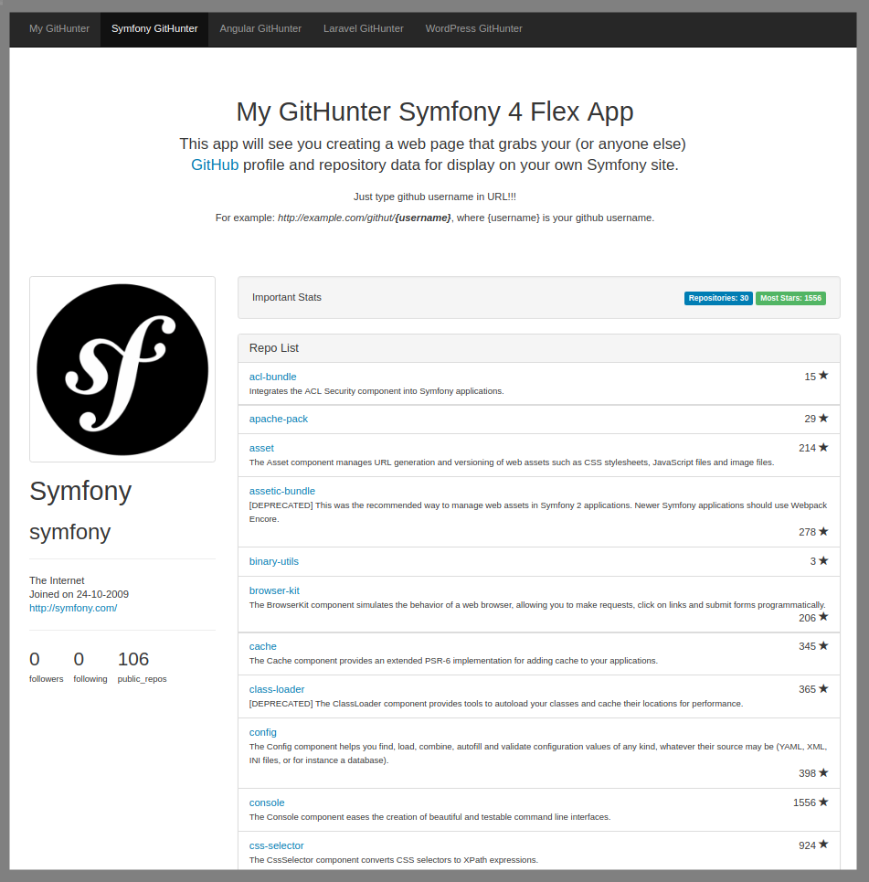

# GitHunter - Symfony 4 Flex App
## View Demo N\A
This Symfony 4 Flex App will see you creating a web page that grabs your (or anyone else)
[GitHub](https://github.com) profile and repository data for display on your own Symfony site.

Just type github `username` in URL

For example: `http://localhost:8000/githut/{username}`, where `{username}` is github username.

Using `eightpoints/guzzle-bundle`.

## Install
Run `composer install` in your root directory.

## App Env Vars
Rename `.env.dist` to `.env`:

## Development server
Run `composer start` or `php bin/console server:start` for start a dev server. Navigate to `http://localhost:8000/`.
Run `composer stop` or `php bin/console server:stop` for stop a dev server.

## Further help
To get more help use my email `maksimgru@gmail.com` or my skype `maksgru` or got to my website [www.m-dev.net](http://www.m-dev.net)

## Screenshots
